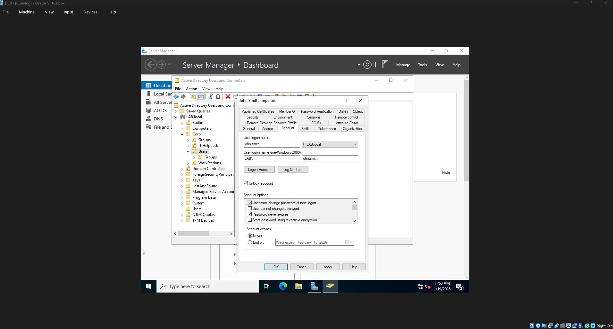
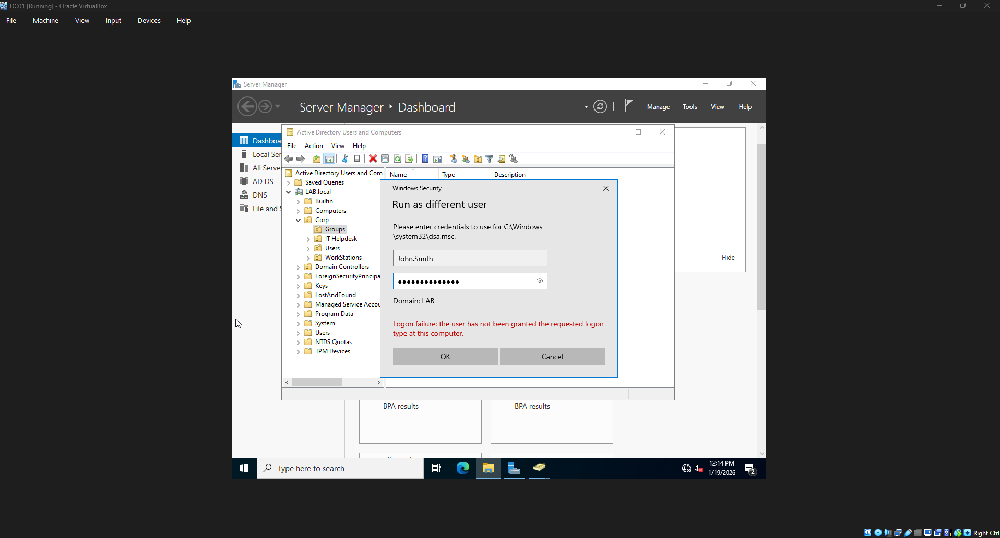
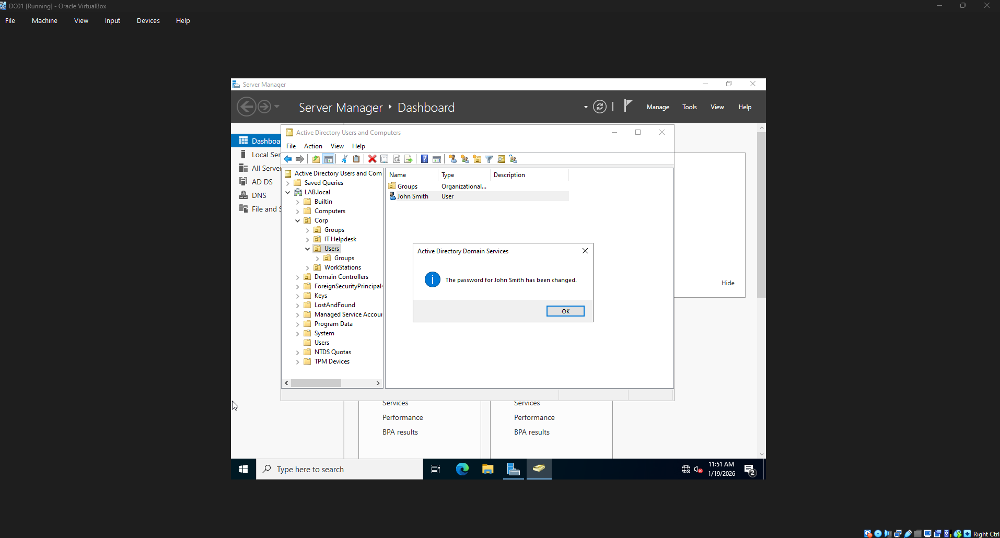

# Active Directory Helpdesk Password Reset Lab testing tstign

## Overview
This lab demonstrates how to implement delegated access in Active Directory, allowing a helpdesk user to reset passwords and unlock accounts while enforcing least-privilege access control. 

## Objectives
- Deploy an Active Directory domain environment
- Create a Helpdesk user account
- Delegate password reset and account unlock permissions
- Verify least privilege by blocking unauthorized admin actions 

## Skills Demonstrated
- Active Directory administration
- Identity and Access Management (IAM)
- Role-Based Access Control (RBAC)
- Delegation of Control in AD
- Password reset and account unlock procedures
- Least-privilege security enforcement

## Lab Environment
- Windows Server (Domain Controller)
- Active Directory Domain Services (AD DS)
- Active Directory Users and Computers (ADUC)

## Key Tasks Performed
1. Created standard user account (John Smith)
2. Created Helpdesk user account
3. Delegated password reset permissions to Helpdesk role
4. Reset user password using delegated account
5. Unlocked locked user account
6. Verified Helpdesk could NOT modify Domain Admin group (least privilege enforcement)

## Security Concepts Covered
- Principle of Least Privilege
- Privileged Access Management
- Account Lockout Handling
- Password Policy Enforcement

## Project Demonstration

1. Account Permissions Configuration  
  
Configured user account settings within Active Directory, including password policies and account options such as forced password reset at next logon and account unlock functionality.

2. Least Privilege Enforcement (Access Denied)  
  
Demonstrates enforcement of least privilege by attempting to run Active Directory tools as a standard user account. The logon failure confirms the user does not have elevated administrative permissions.

3. Password Reset and Account Recovery  
  
Performed a successful password reset for a domain user account, validating helpdesk-level permissions for account management tasks.
